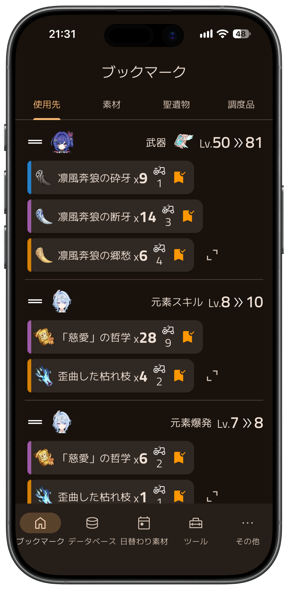

# 原神素材ノート

[English](./README.md) | 日本語

原神の育成素材ブックマーク＆データベースアプリ。

  
  

## 機能

- **ブックマーク** — キャラクター・武器の育成に必要な素材や、聖遺物、調度品をブックマークできます。用途別・素材別に一覧できます。
- **データベース** — キャラクター、武器、素材、聖遺物、調度品セットの情報を閲覧できます。
- **日替わり素材** — 今日入手できる天賦素材・武器素材を確認できます。ブックマークした素材が入手できる日に通知を受け取ることもできます。
- **ツール** — 樹脂回復時刻計算機、HoYoLAB のログインボーナス。
- **HoYoLAB 連携** — キャラクター・武器のレベル、バッグ内のアイテム数、樹脂を HoYoLAB から同期できます（グローバル版のみ）。

## 免責事項

本アプリは非公式のファンメイドアプリであり、HoYoverse とは一切関係ありません。
原神および関連する名称・画像・ゲームデータの権利は HoYoverse に帰属します。

Apple および Apple ロゴは、米国およびその他の国や地域で登録された Apple Inc. の商標です。App Store は Apple Inc. のサービスマークです。

Google Play および Google Play ロゴは Google LLC の商標です。

## ライセンス

ソースコードは [MIT License](./LICENSE) で公開しています。

アプリ内で表示されるゲームデータ、画像、および[readme_assets](./readme_assets) 内のファイルはこのライセンスの対象外です。

## 開発

[DEVELOPMENT.md](./DEVELOPMENT.md)（英語）を参照してください。
