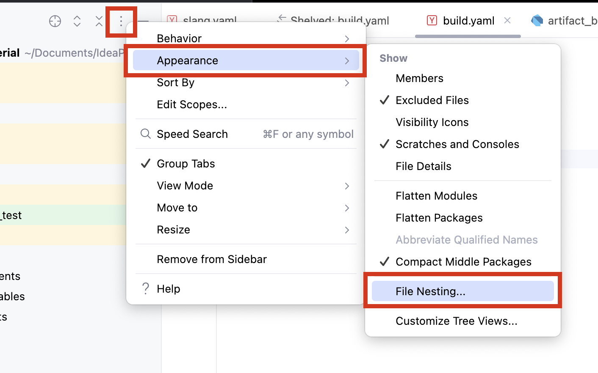
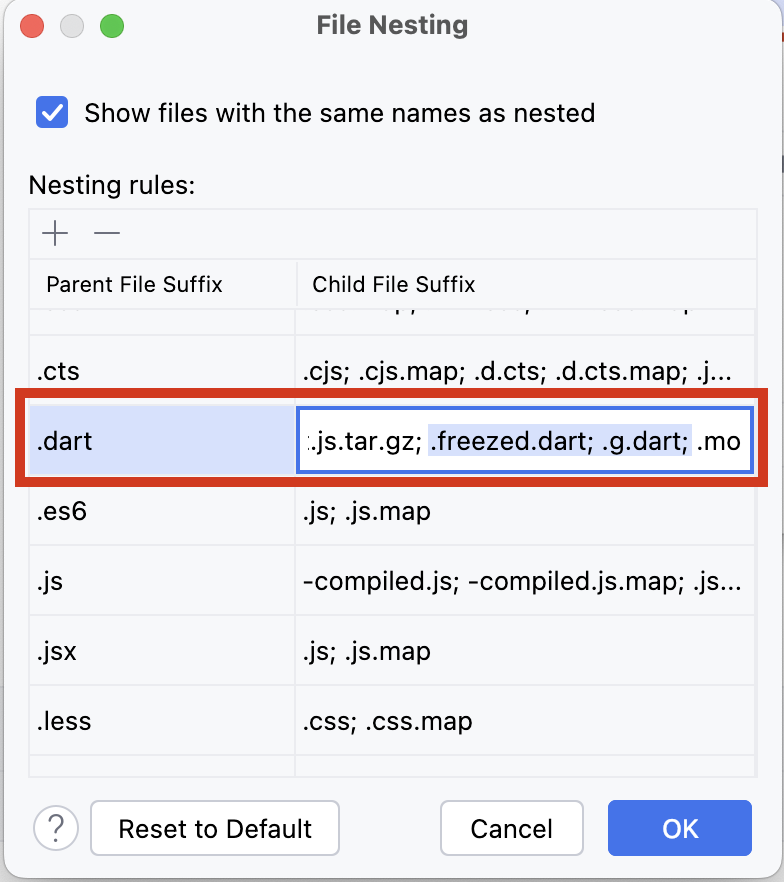

# genshin_material

Material bookmark & database for Genshin Impact

## Features

In progress

## Development

### Before Building

To build this app successfully, you need to set up Firebase with **your own project**. First, create a Firebase project at [Firebase Console](https://console.firebase.google.com/).

1. Install Firebase CLI (follow the [official guide](https://firebase.google.com/docs/cli?hl=ja#setup_update_cli)).
2. Run `firebase login` to log in to Firebase.
3. Install FlutterFire CLI
    ```shell
    $ dart pub global activate flutterfire_cli
    ```
4. Run `flutterfire configure` to set up Firebase for this project. Follow the instructions on the console.

### About Generated Files

In this project, files generated by Freezed, Riverpod, etc. are included in the same directory.
To improve the readability of the file list, configure **File Nesting**.

#### IntelliJ IDEA

Add `.freezed.dart` and `.g.dart` to `.dart` parent file suffix.



