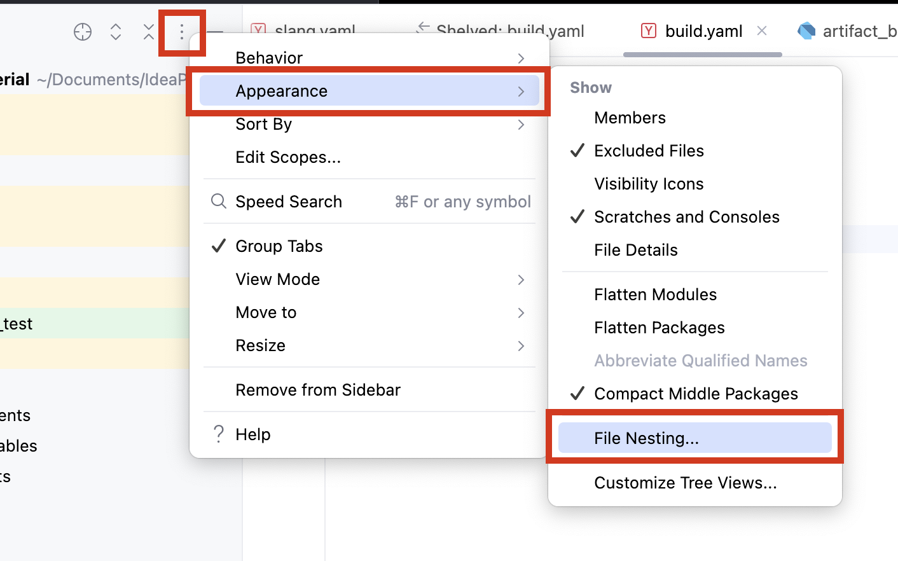
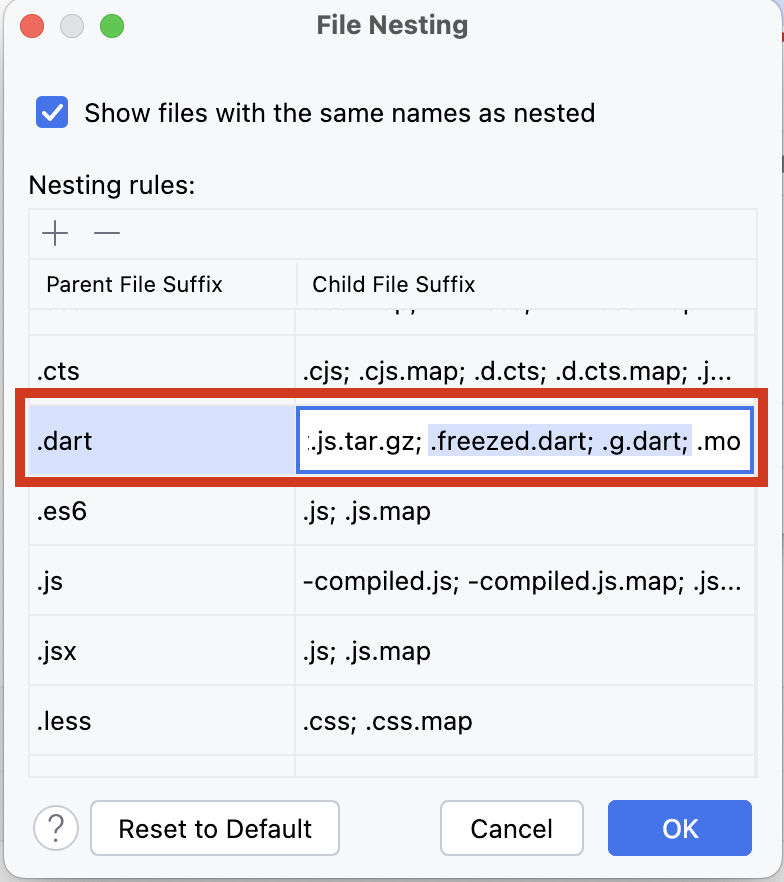

# Genshin Material Notebook

English | [日本語](./README.ja.md)

Material bookmark & database app for Genshin Impact, available on iOS and Android.

<!-- Store badges -->

<p>
  
  
  
  
</p>

## Features

- **Bookmarks** — Bookmark the materials needed to level up characters and weapons, as well as artifacts and furnishings. View them by purpose or by material.
- **Database** — Browse characters, weapons, materials, artifacts, and furnishing sets.
- **Daily materials** — See which talent and weapon materials are available today, and get notified on the days your bookmarked materials are available.
- **Tools** — Resin recovery time calculator and HoYoLAB Daily Check-In.
- **HoYoLAB link** — Sync character and weapon levels, item counts in your bag, and resin from HoYoLAB (global version only).

## Disclaimer

This is an unofficial fan-made app and is not affiliated with or endorsed by HoYoverse.
Genshin Impact and all related names, images, and game data are the property of HoYoverse.

## License

The source code is licensed under the [MIT License](./LICENSE).
Game data and images displayed in the app are not covered by this license.

## Development

### Requirements

- [FVM](https://fvm.app) (the Flutter version is pinned in `.fvmrc`)

### Before Building

To build this app, you need to set up Firebase with **your own project**.

1. Create a project in the [Firebase Console](https://console.firebase.google.com/) and enable **Crashlytics** and **Remote Config**.
2. Register an Android app and an iOS app with the package name / bundle ID `net.chikach.genshinmaterial`.
3. Download the config files from the project settings and place them as follows:
    - `google-services.json` → `android/app/`
    - `GoogleService-Info.plist` → `ios/Runner/`

### Build & Run

Use FVM to run the app.

```shell
$ fvm flutter run
```

For commands, architecture, and coding conventions, see [CLAUDE.md](./CLAUDE.md).

### About Generated Files

In this project, files generated by Freezed, Riverpod, etc. are included in the same directory.
To improve the readability of the file list, configure **File Nesting**.

#### IntelliJ IDEA

Add `.freezed.dart` and `.g.dart` to `.dart` parent file suffix.



